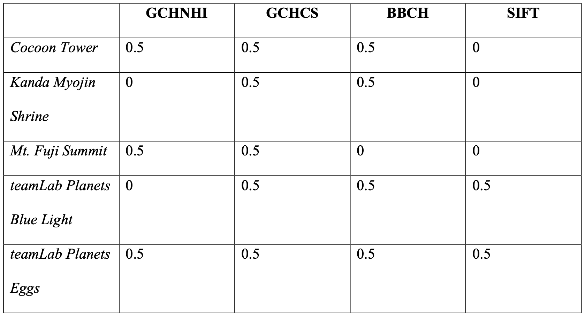

# ImageGoogle
A search tool that can find the similar images in a large set of unorganized personalized images by using an image of interest

### Presentation
https://youtu.be/qESy-aJIDPs

### Search Algorithms
1. Global color histogram
    1. Normalized Histogram Intersection
    2. Chi-square
2. Block-based color histogram
    1. Histogram Intersection
3. SIFT (Scale-Invariant Feature Transform)
    1. Bag of Visual Words

### Evaluation Tool
picArrange - https://apps.apple.com/us/app/picarrange/id1530678223

### Results
